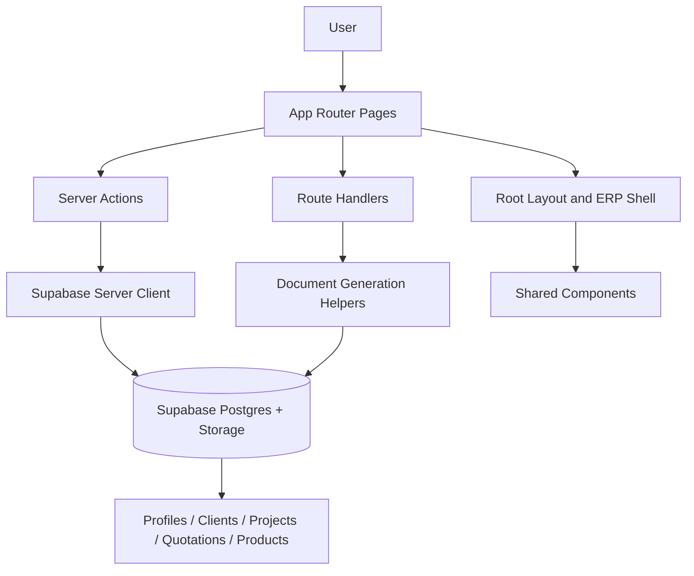

# Architecture

## App Router Structure

The app is organized by business domain under `app/`:

- `app/dashboard`
- `app/quotations`
- `app/projects`
- `app/procurement`
- `app/products`
- `app/clients`
- `app/settings`
- `app/auth`
- `app/api`

The root `app/page.tsx` redirects to `/dashboard`.

## Layouts

`app/layout.tsx` sets:

- App metadata and icons
- Geist fonts
- PWA registration
- Global loading indicators
- UI state preservation

## Shared Components

Shared UI is grouped under `components/` by feature area:

- `components/layout`
- `components/dashboard`
- `components/quotations`
- `components/products`
- `components/procurement`
- `components/settings`
- `components/clients`

The app uses a reusable ERP shell instead of page-local chrome.

## Authentication

Central auth logic lives in `lib/auth.ts`.

- `requireActiveUser()` blocks anonymous users and inactive accounts
- Disabled users are signed out and redirected
- Active-but-unapproved users go to `/pending-approval`
- Role guards gate settings, procurement, records, and library access

## Supabase Integration

The app uses:

- `lib/supabase/server.ts` for server-side access
- `lib/supabase/admin.ts` for privileged server queries
- `lib/supabase/client.ts` for client-side access where needed
- `lib/supabase/types.ts` for generated table types

Security is enforced again in Supabase migrations with RLS and helper functions.

## Server Actions

Mutation logic is split into `actions.ts` files next to the routes they serve.

Typical responsibilities:

- Create and update clients
- Save quotation and document settings
- Manage HR, workers, and settings data
- Perform product library mutations

## Route Handlers

Route handlers live under `app/api/` and in download routes inside quotation folders.

Main uses:

- Export PDFs
- Export PPTX files
- Export Excel files
- Proxy presentation images
- Save quotation-specific document settings

## State Management

The codebase is mostly server-driven:

- Server components fetch data directly
- Forms submit through server actions
- Some local quotation workflow state is persisted in browser storage via Dexie

I did not verify a separate global client-store architecture.

## Document Generation

Document output starts from quotation-specific route handlers and helper libraries:

- PDF generation: `lib/server/generate-pdf-buffer.ts`
- Excel export: `app/api/export-quotation/route.ts`
- PowerPoint generation: `lib/quotations/presentation-pptx.ts`

Libraries used:

- `puppeteer-core`
- `@sparticuz/chromium-min`
- `ExcelJS`
- `PptxGenJS`
- `sharp`

## Folder Responsibilities

- `app/` route entry points and page composition
- `components/` reusable UI
- `lib/` business logic, helpers, and data access
- `supabase/migrations/` schema and RLS source
- `public/` static assets and icons

## Architecture Diagram

