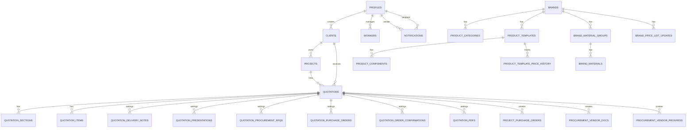

# Database

Schema source: Supabase migrations under `supabase/migrations/`.

## Major Tables

### Identity and Access

- `profiles`
- `profiles_hr`
- `workers`
- `notifications`

Important fields:

- `profiles.role`
- `profiles.account_status`
- `profiles.full_name`
- `profiles.email`
- `profiles_hr.date_of_joining`
- `profiles_hr.emirates_id_expiry`
- `profiles_hr.passport_expiry`
- `workers.status`

### Clients and Projects

- `clients`
- `projects`

Important fields:

- `clients.company_name`
- `clients.client_code`
- `clients.is_active`
- `projects.client_id`
- `projects.project_name`
- `projects.project_code`
- `projects.project_status`
- `projects.is_active`

### Quotations

- `quotations`
- `quotation_sections`
- `quotation_items`
- `quotation_delivery_notes`
- `quotation_presentations`
- `quotation_procurement_rfqs`
- `quotation_purchase_orders`
- `quotation_order_confirmations`
- `quotation_pdfs`

Important fields:

- `quotations.quotation_no`
- `quotations.project_id`
- `quotations.status`
- `quotations.currency`
- `quotations.vat_percent`
- `quotations.grand_total`
- `quotations.approved_at`
- `quotation_items.item_type`
- `quotation_items.sort_order`
- `quotation_items.is_optional`
- `quotation_sections.sort_order`
- `quotation_delivery_notes.dn_number`
- `settings_json` on the document-setting tables

### Products

- `brands`
- `product_categories`
- `product_templates`
- `product_components`
- `brand_material_groups`
- `brand_materials`
- `brand_price_list_updates`
- `product_template_price_history`

Important fields:

- `brands.name`
- `brands.is_active`
- `product_categories.brand_id`
- `product_templates.template_name`
- `product_templates.lifecycle_status`
- `product_templates.default_unit_price`
- `product_templates.last_price_checked_at`
- `product_components.component_group`
- `product_components.option_type`
- `brand_materials.material_name`
- `brand_price_list_updates.status`
- `product_template_price_history.changed_at`

### Procurement

- `project_purchase_orders`
- `procurement_vendor_docs`
- `procurement_vendor_progress`

Important fields:

- `project_purchase_orders.order_no`
- `project_purchase_orders.po_number`
- `project_purchase_orders.vendor_key`
- `procurement_vendor_docs.slot_key`
- `procurement_vendor_progress.active_step`
- `procurement_vendor_progress.etd`
- `procurement_vendor_progress.eta`

### Company Settings

- `company_settings`

Important fields:

- `company_name`
- `display_name`
- `default_currency`
- `vat_percent`
- `logo_url`

## Main Relationships

- `clients` 1 -> many `projects`
- `clients` 1 -> many `quotations`
- `projects` 1 -> many `quotations`
- `quotations` 1 -> many `quotation_sections`
- `quotations` 1 -> many `quotation_items`
- `quotations` 1 -> 1 document-settings tables
- `brands` 1 -> many `product_categories`
- `brands` 1 -> many `product_templates`
- `brands` 1 -> many `brand_material_groups`
- `brand_material_groups` 1 -> many `brand_materials`
- `product_templates` 1 -> many `product_components`
- `product_templates` 1 -> many `product_template_price_history`
- `quotations` 1 -> many procurement records

## Status Fields

- `profiles.account_status`: `pending`, `active`, `disabled`
- `profiles.role`: app role enum
- `projects.project_status`: `active`, `on_hold`, `completed`, `cancelled`
- `quotations.status`: current workflow status
- `brand_price_list_updates.status`: `draft`, `active`, `archived`
- `product_templates.lifecycle_status`: `active`, `archived`, `discontinued`
- `workers.status`: `active`, `on_leave`, `offboarded`

## ER Diagram

